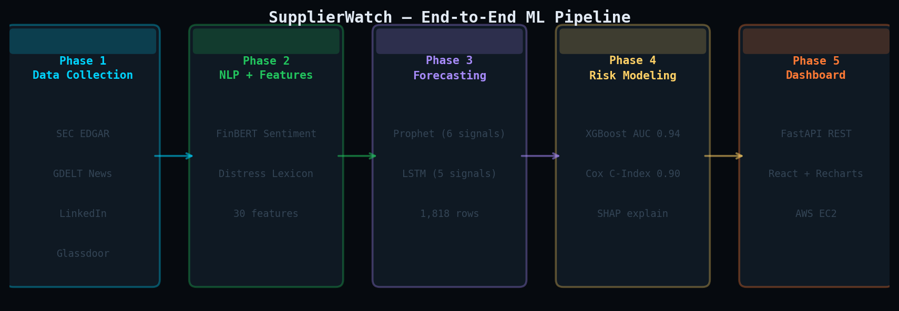
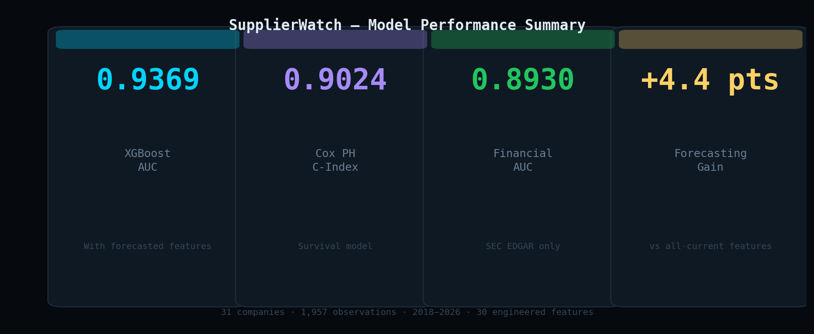
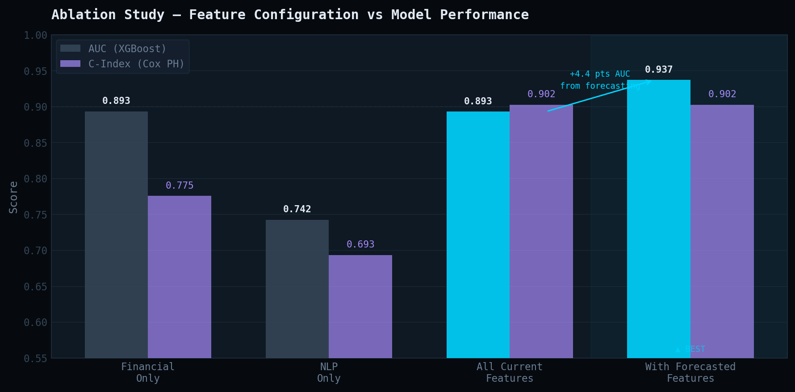
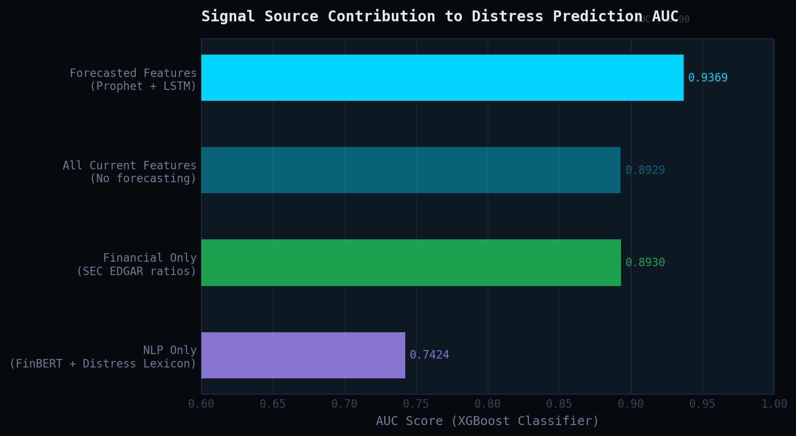
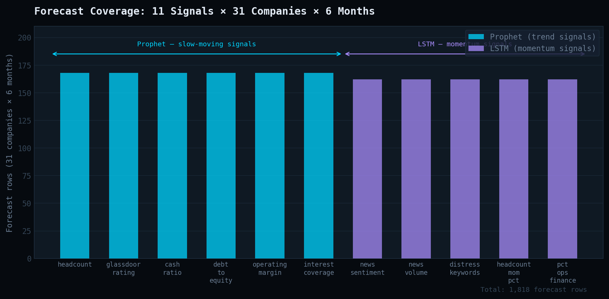
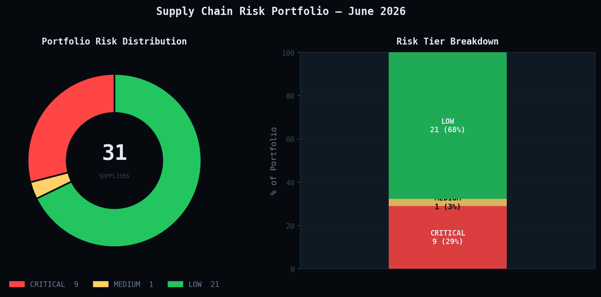

# SupplierWatch
### ML-Powered Early Warning System for Supply Chain Distress

[](https://python.org)
[](https://fastapi.tiangolo.com)
[](https://react.dev)
[](#deployment)
[](#model-performance)

**Predicts which suppliers in a portfolio will enter financial distress 6 months before it happens**, using NLP signals, time-series forecasting, and survival modeling, deployed as a full-stack risk intelligence dashboard.

🔗 [**Live Demo**](http://18.217.251.162)
---

## The Problem

Supply chain risk teams find out a supplier is in trouble the same way everyone else does, when the delivery doesn't show up. By then it's too late to requalify an alternate vendor. The signals of distress (cost-cutting hiring patterns, declining news sentiment, deteriorating cash position) are visible months earlier, scattered across sources nobody is systematically watching.

**SupplierWatch consolidates those signals and asks a forward-looking question: not "is this supplier struggling today," but "where is this supplier headed over the next 6 months."**

---

## Why This Approach Is Different

Most distress-prediction projects stop at binary classification on a snapshot of current financials. Three decisions here go further, and each one is measurable:

| Decision | Why it matters | Measured impact |
|---|---|---|
| **Forecast signals before scoring** (Prophet + LSTM) | Risk should reflect trajectory, not a static snapshot | **+4.4 AUC points** over current-only features |
| **Survival modeling (Cox PH), not just classification** | Procurement needs *when*, not just *if* | C-index **0.9024**, usable for time-to-escalation planning |
| **SHAP at the individual-supplier level** | A portfolio-wide importance ranking doesn't help a specific escalation decision | Per-supplier waterfall drives the auto-generated analyst brief |

---

## Pipeline Architecture



Five phases, each independently runnable: data collection → NLP feature extraction → signal forecasting → risk modeling → deployed dashboard.

---

## Model Performance



| Metric | Value | Model | What it answers |
|---|---|---|---|
| **AUC** | **0.9369** | XGBoost (forecasted features) | Will this supplier be distressed in 6 months? |
| **C-Index** | **0.9024** | Cox Proportional Hazards | When, relative to other suppliers, will distress hit? |
| AUC | 0.8930 | XGBoost (financial-only) | Baseline using SEC filings alone |
| AUC | 0.8929 | XGBoost (all current features) | Baseline using NLP + financial + headcount, no forecasting |
| AUC | 0.7424 | XGBoost (NLP-only) | News/text signal alone, weakest standalone predictor |

### Ablation Study, Does Forecasting Actually Help?



This is the central experiment of the project. Four identical model configurations, same train/test split, only the feature set changes:

- Swapping current-period values for **6-month forecasted trajectories** raised AUC from **0.8929 → 0.9369**
- That's a real, attributable gain, not from a better model, but from a better *framing* of the input
- C-index stayed flat between "all current" and "with forecasts" (0.9024 in both), which makes sense: Cox PH already models time explicitly, so forward-looking point forecasts add less marginal information there than they do for the classifier

**Takeaway for design discussions:** forecasting pays off most for models that only see a snapshot (XGBoost), less for models that already reason about time natively (Cox PH).

### Signal Source Contribution



Breaking AUC down by which signal family is driving it:

- **Financial ratios alone (SEC EDGAR)** already reach 0.893 AUC, confirming that hard financial structure is the strongest single predictor of distress, which matches financial-economics intuition
- **NLP alone reaches only 0.742**, sentiment and keyword signals are real but noisy on their own
- Combining everything without forecasting doesn't beat financials alone (0.8929 vs 0.8930), meaning the NLP and headcount signals were **redundant with financials in their current-period form**
- Forecasting is what unlocks the NLP signal's value, once sentiment and keyword scores are projected forward, they stop being redundant and start contributing real information the financials don't carry alone

This is the kind of result that's more credible *because* it isn't uniformly positive, it tells a coherent story about where the signal actually lives.

---

## Forecasting Design



Eleven signals are forecasted 6 months forward per supplier, using two different models chosen deliberately by signal behavior, not the same model applied everywhere:

| Model | Signals | Why this model |
|---|---|---|
| **Prophet** | headcount, glassdoor_rating, cash_ratio, debt_to_equity, operating_margin, interest_coverage | These move slowly with trend + seasonal structure, Prophet's decomposition is built for exactly this |
| **LSTM (PyTorch)** | news_sentiment, news_volume, distress_keywords, headcount_mom_pct, pct_ops_finance_roles | These are noisy and momentum-driven, an LSTM captures non-linear short-term dynamics that Prophet's additive model would smooth away |

**1,818 forecast rows** generated (1,008 Prophet + 810 LSTM) across 31 companies × 6-month horizon × 11 signals.

---

## Live Portfolio Snapshot



Current model output across the tracked portfolio of 31 suppliers:

| Tier | Count | % of Portfolio | Recommended Action |
|---|---|---|---|
| 🔴 CRITICAL | 9 | 29% | Immediate escalation, alternate sourcing review |
| 🟡 MEDIUM | 1 | 3% | Flag for quarterly review |
| 🟢 LOW | 21 | 68% | Standard monitoring cadence |

---

## Dataset

| Attribute | Value |
|---|---|
| Companies tracked | 31 (mix of historically distressed + healthy controls) |
| Observations | 1,957 company-month rows |
| Date range | Jan 2018 – May 2026 |
| Engineered features | 30 (19 current-period + 11 forecasted) |
| Distress rate | 3.9%, kept at realistic class imbalance, no artificial resampling at evaluation time |
| Train / test split | 2018–2021 / 2022–2026, strict temporal split, no leakage |

**Data sources (all free or low-cost):**
- **SEC EDGAR API**, quarterly 10-K/10-Q filings: revenue, cash ratio, debt-to-equity, operating margin, interest coverage
- **GDELT**, 5 years of news headlines per company, scored with FinBERT for financial sentiment
- **LinkedIn (via Proxycurl)**, monthly headcount snapshots, job-posting velocity, % ops/finance hiring mix
- **Glassdoor**, public rating trends and review volume

---

## System Architecture

```
Phase 1, Data Collection
  SEC EDGAR → financials   |   GDELT → news   |   Proxycurl → headcount/jobs   |   Glassdoor → reviews
         ↓
Phase 2, NLP + Feature Engineering
  FinBERT sentiment   |   TF-IDF distress lexicon   |   → feature_matrix (1,957 × 42 parquet)
         ↓
Phase 3, Signal Forecasting
  Prophet (6 trend signals)   |   LSTM (5 momentum signals)   |   → 1,818 forecast rows, 6-month horizon
         ↓
Phase 4, Risk Modeling
  XGBoost (AUC 0.9369)   |   Cox PH survival (C-index 0.9024)   |   SHAP explainability   |   MLflow tracking
         ↓
Phase 5, Deployment
  FastAPI REST API   |   React + Recharts dashboard   |   nginx reverse proxy   |   AWS EC2 + systemd
```

---

## Dashboard

**Leaderboard**, all 31 suppliers ranked by 6-month distress probability, with inline sparklines per row showing trajectory at a glance, filterable by sector and risk tier.

**Company deep-dive**, SVG risk gauge, live signal bars, and four tabs:
- **Signal History**, toggleable multi-signal timeline across the full data window
- **6-Month Forecast**, historical signal bridging into Prophet/LSTM projection with confidence bands
- **SHAP Waterfall**, which features are driving *this specific* supplier's score, centered bar chart
- **Analyst Brief**, auto-generated procurement memo with a risk-tiered recommendation

**REST API** (Swagger docs at `/api/docs`):
```
GET /companies              ranked, filterable leaderboard
GET /company/{id}           full company profile + current risk
GET /company/{id}/signals   full historical signal timeline
GET /company/{id}/forecast  6-month Prophet + LSTM projections
GET /company/{id}/shap      per-supplier SHAP attribution
GET /company/{id}/brief     auto-generated analyst memo
GET /stats                  portfolio summary
GET /sectors                available filters
```

---

## Deployment

Deployed on **AWS EC2** (Ubuntu, t3.small) with:
- **nginx** serving the built React frontend and reverse-proxying `/api/*` to FastAPI
- **systemd** running the FastAPI backend as a managed service with auto-restart on failure/reboot
- **Docker Compose** available as an alternative one-command deployment path (API + frontend + Postgres + MLflow)

This was a deliberate choice over PaaS platforms (Railway/Render): running the full stack on raw EC2 means owning the nginx config, the process manager, and the deployment pipeline end to end, the same skills required to ship a real production service.

---

## Reproducing This Project

```bash
git clone https://github.com/foyie/supplier-distress.git
cd supplier-distress
python3 -m venv venv && source venv/bin/activate
pip install -r requirements.txt
cp .env.example .env   # add DB credentials + API keys

# Phase 1, Data collection
python phase1_data/db_schema.py
python phase1_data/seed_companies.py
python phase1_data/collect_sec_data.py
python phase1_data/collect_news.py --source gdelt
python phase1_data/collect_linkedin.py --mode both

# Phase 2, NLP + feature matrix
python phase2_nlp/nlp_extractor.py
python phase2_nlp/build_feature_matrix.py

# Phase 3, Forecasting
python phase3_forecasting/forecaster.py --model both

# Phase 4, Modeling
python phase4_modeling/train_models.py --ablation

# Phase 5, Dashboard
cd phase5_dashboard/backend  && uvicorn main:app --reload --port 8000
cd phase5_dashboard/frontend && npm install && npm run dev
```

Or with Docker:
```bash
cd phase5_dashboard && docker compose up --build
```

---

## Project Structure

```
supplier-distress/
├── phase1_data/           data collection, SEC, GDELT, LinkedIn, Glassdoor
├── phase2_nlp/             FinBERT sentiment + feature matrix builder
├── phase3_forecasting/     Prophet + LSTM signal forecasting
├── phase4_modeling/        XGBoost + Cox PH + SHAP + MLflow
├── phase5_dashboard/
│   ├── backend/            FastAPI REST API + Dockerfile
│   └── frontend/           React + Vite + Recharts dashboard
├── data/processed/         feature matrices (.parquet)
├── data/forecasts/         forecast outputs (.parquet)
├── models/                 trained model + ablation results
└── plots/                 README figures
```

---

## Tech Stack

**Modeling**, XGBoost · scikit-survival · lifelines · SHAP · Prophet · PyTorch (LSTM) · HuggingFace Transformers (FinBERT) · scikit-learn · MLflow

**Data Collection**, SEC EDGAR API · GDELT · Proxycurl · Playwright · NewsAPI

**Backend**, FastAPI · PostgreSQL · SQLAlchemy · uvicorn · Docker

**Frontend**, React 18 · Vite · Recharts

**Infrastructure**, AWS EC2 · nginx · systemd · Docker Compose

---

## Validation Approach

- **Strict temporal split** (train ≤2021, test 2022–2026), no future information leaks into training
- **Realistic imbalance preserved** at evaluation (3.9% distress rate), avoiding inflated metrics from artificial resampling
- **Two complementary model families** evaluated on the same split, a classifier (AUC) and a survival model (C-index), so the result isn't an artifact of one modeling choice
- **Ablation isolates the forecasting contribution** specifically, rather than just reporting a single final number
- Test set includes real distress events: Revlon (2022), Bed Bath & Beyond (2023), Yellow Corporation (2023), Rite Aid (2023)

---

## Author

**Chandrima Das**
MS Data Science · University of California San Diego

[](mailto:chdas@ucsd.edu)
[](https://linkedin.com/in/foyie/)
[](https://github.com/foyie)
[](https://foyie.github.io/foyie)

---

*Model v1.0 · Data coverage Jan 2018 – May 2026 · Last updated June 2026*
